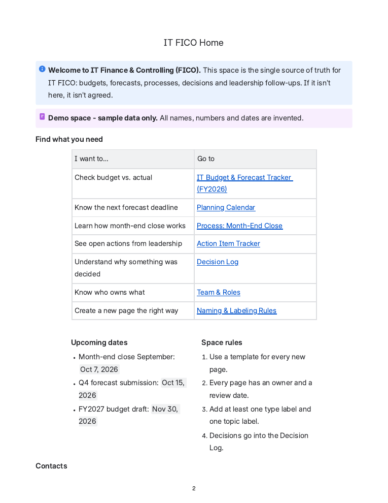
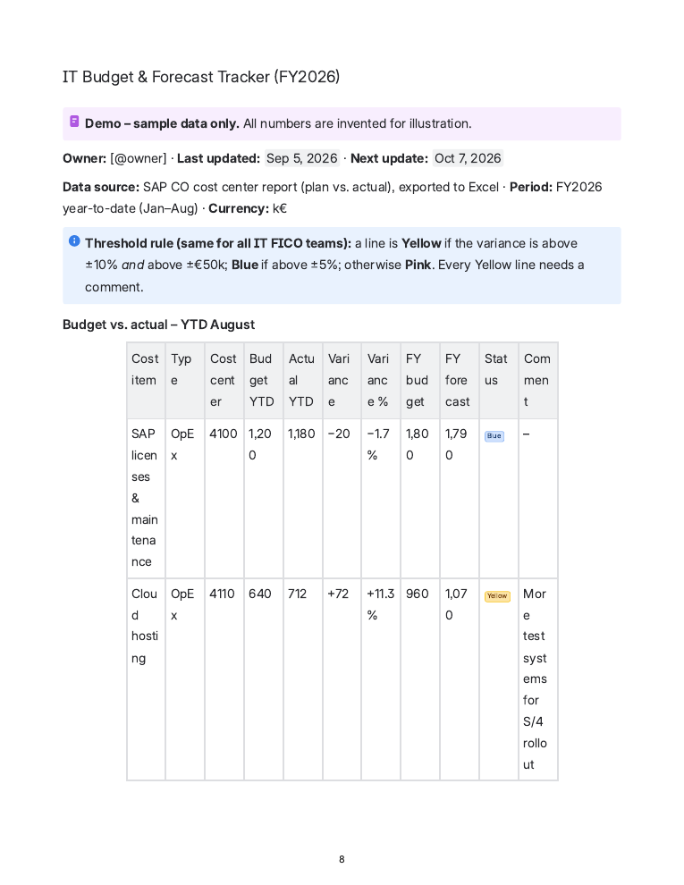
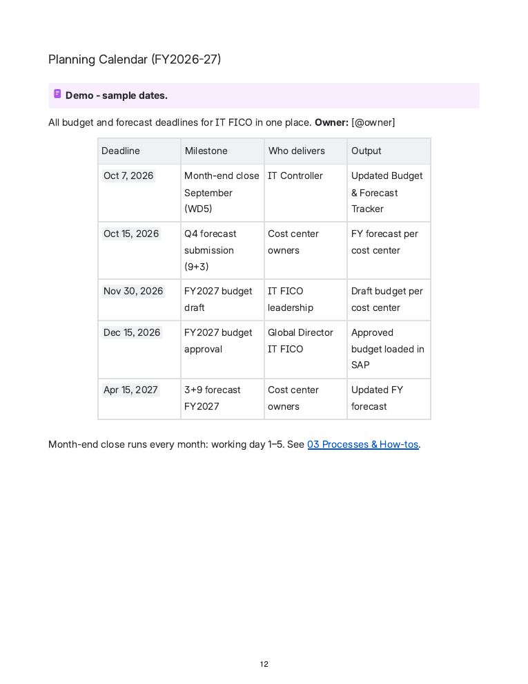
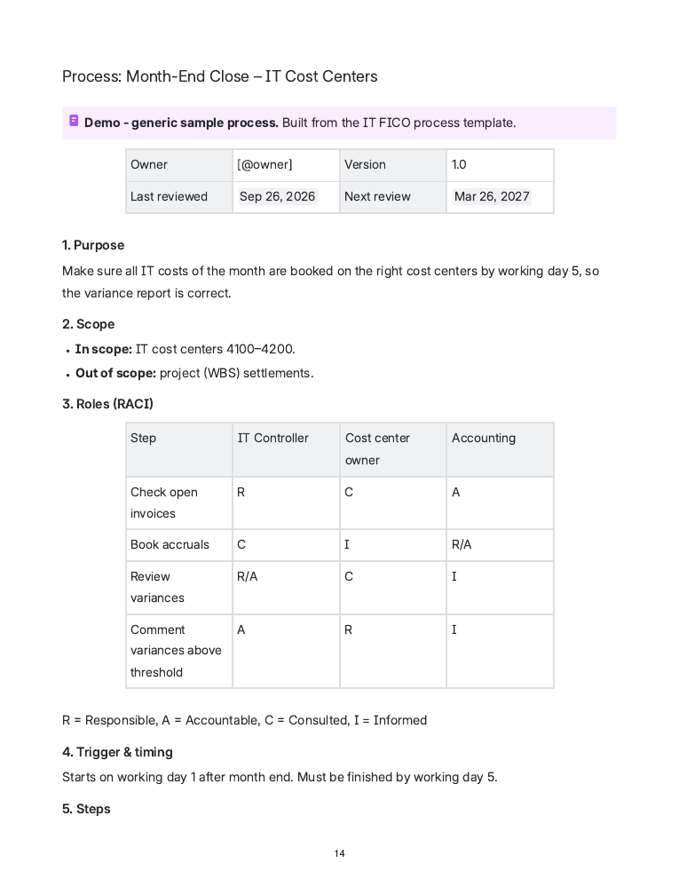
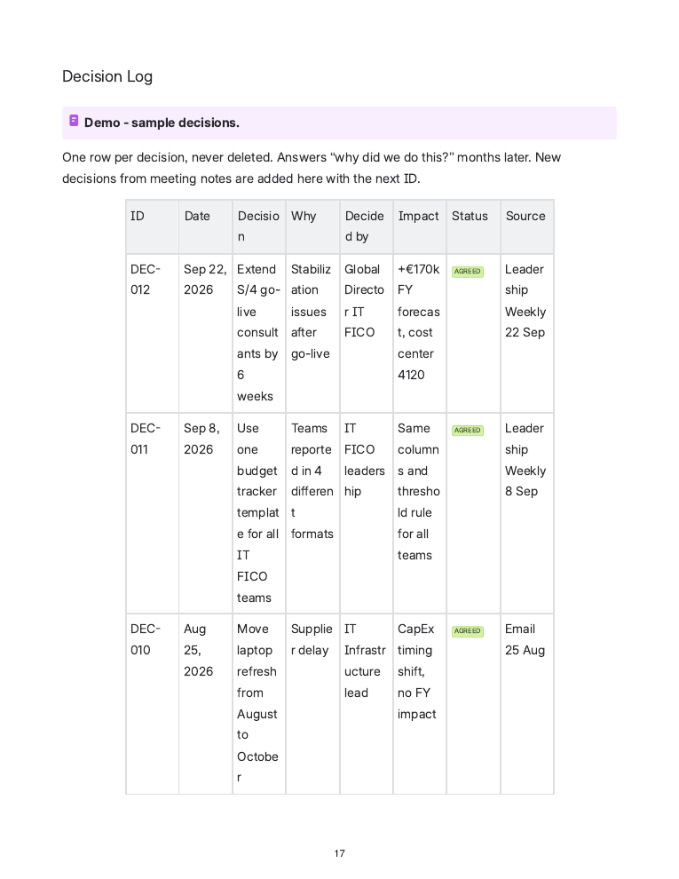
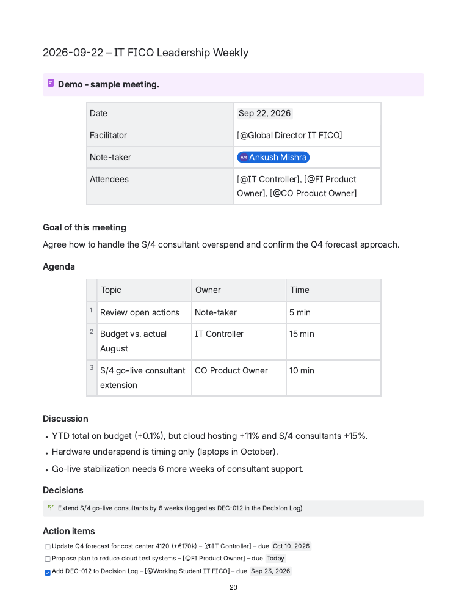
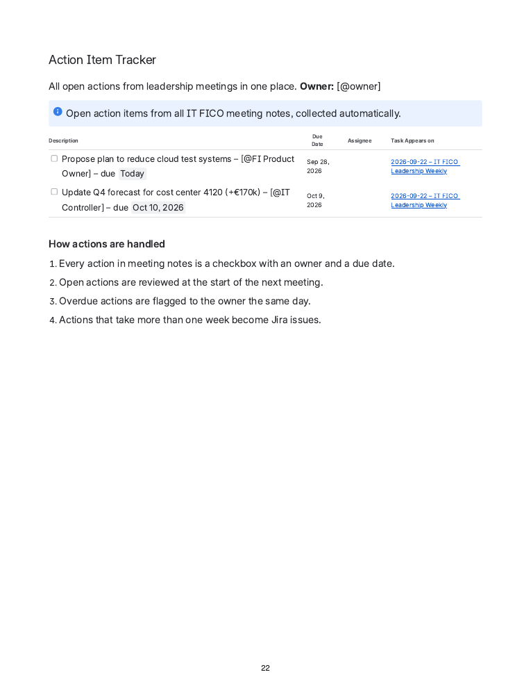
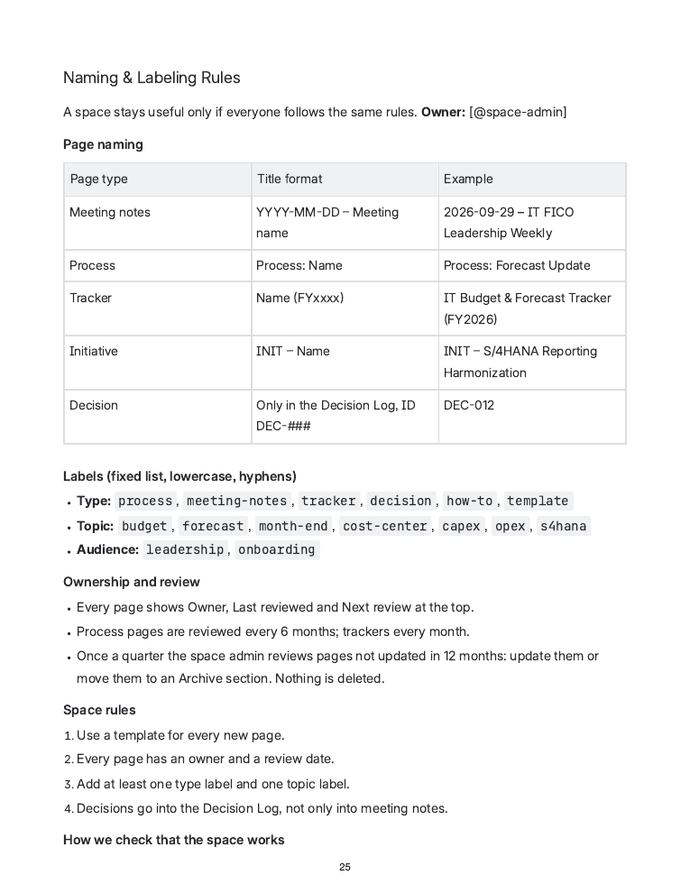

# IT FICO - Management Operations & Leadership Support

A complete Confluence space I designed for an **IT Finance & Controlling (FICO)** team: one place for budgets, forecasts, processes, decisions and leadership follow-ups.

> **Demo project – sample data only.** All names, numbers and dates are invented.

📄 **Full export:** [IT-FICO-Confluence-Space-Export.pdf](docs/IT-FICO-Confluence-Space-Export.pdf) (26 pages)

🔒 Built in Confluence Cloud. Live space available on request (private workspace).

---

## The problem

IT FICO teams often report budgets in different formats, decisions get lost in email and meeting notes, and nobody knows which page is current. This space fixes that with a fixed structure, templates and clear rules.

## Space structure

| Section | What it holds |
|---|---|
| **01 About IT FICO** | Team & Roles – who owns what |
| **02 Budget & Forecasting** | IT Budget & Forecast Tracker (FY2026), Planning Calendar (FY2026-27) |
| **03 Processes & How-tos** | Month-End Close – IT Cost Centers (with RACI) |
| **04 Leadership Support** | Decision Log, Meeting Notes, Action Item Tracker |
| **05 Projects & Initiatives** | One page per initiative, linked to Jira |
| **06 Templates & Guidelines** | Naming & Labeling Rules |

## Key features

- **Budget vs. actual tracker** – SAP CO cost center data (plan vs. actual, k€), one threshold rule for all teams (variance > ±10% *and* > ±€50k → needs a comment), plus key messages for leadership.
- **Planning calendar** – every forecast and budget deadline with owner and output.
- **Process documentation** – standard template: purpose, scope, RACI, trigger, steps, systems, change history.
- **Decision Log** – one row per decision (DEC-###), never deleted; answers "why did we do this?" months later.
- **Meeting notes → action items** – every action is a task with owner and due date; the Action Item Tracker collects open tasks from all meeting notes automatically.
- **Governance** – naming rules, a fixed label list (type / topic / audience), owner and review date on every page, quarterly archive review, and simple success measures (e.g. >90% of pages built from a template).

## Screenshots

| Budget & Forecast Tracker | Planning Calendar |
|---|---|
|  |  |

| Month-End Close Process | Decision Log |
|---|---|
|  |  |

| Meeting Notes | Action Item Tracker |
|---|---|
|  |  |

| Naming & Labeling Rules |
|---|
|  |

## Tools & concepts

Confluence (page tree, templates, task lists, Task Report macro, status lozenges, labels) · Jira · SAP S/4HANA FI/CO · Excel · RACI · budget vs. actual & forecast (3+9 / 6+6 / 9+3) · OpEx / CapEx · documentation governance

## Author

**Ankush Mishra** – M.Sc. International Information Systems, FAU Erlangen-Nürnberg · [GitHub](https://github.com/ankush-sh)
